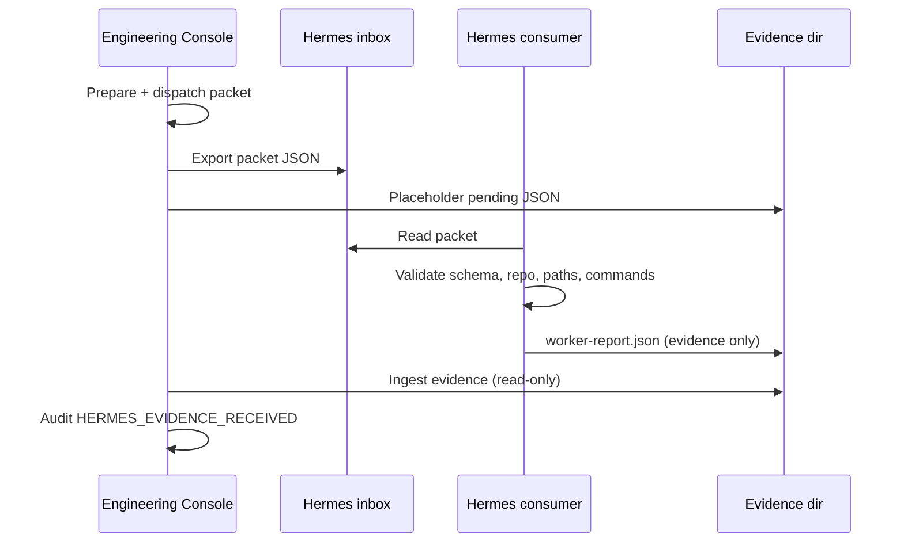

# Hermes packet consumer and evidence return (Phase 7)

Phase 6 exports governed `hermes-run-packet/v1` JSON to the Hermes inbox. Phase 7 adds a **Hermes-side dry-run consumer** that validates packets and writes `hermes-engineering-evidence/v1` reports, plus **Engineering Console ingest** that reads those reports for operator review only.

## Flow



## Hermes consumer (dry-run)

Location: `~/.hermes/scripts/consume-engineering-packet.mjs`

```bash
# From packet file
node ~/.hermes/scripts/consume-engineering-packet.mjs --file /path/to/packet.json

# Or wrapper
~/.hermes/bin/hermes-consume-engineering-packet --file /path/to/packet.json

# Latest inbox packet
node ~/.hermes/scripts/consume-engineering-packet.mjs --inbox --latest
```

Environment:

| Variable | Purpose |
|----------|---------|
| `HERMES_ENGINEERING_REPO_ROOTS` | Comma-separated repo roots (must include packet `target.repoPath`) |
| `HERMES_ENGINEERING_INBOX` | Override inbox directory |
| `HERMES_EXPECTED_PACKET_HASH` | Optional SHA-256 verification |

Behavior:

- Validates `hermes-run-packet/v1` and governance fields
- Rejects repos outside allowlist, forbidden paths in scope, non-allowlisted commands
- **Does not** run shell commands or mutate the repository (inspection / stat only)
- Writes evidence **only** to `{placeholderDir}/worker-report.json`

Evidence schema: `hermes-engineering-evidence/v1` with `status`: `inspected` | `failed` (dry-run uses `inspected` on success).

## Engineering Console ingest

| Endpoint | Purpose |
|----------|---------|
| `GET /api/engineer-console/runs/{id}/hermes-worker/evidence` | Read latest evidence report from disk; audit once per dispatch |

Bridge run evidence summary includes `hermesWorkerEvidence` (availability, status, boundary flag). **Not** used for approval or sign-off.

Audit: `HERMES_EVIDENCE_RECEIVED` when evidence is first observed.

## Rules

- Hermes output is **evidence input only**
- Console remains **source-of-truth** for tasks, runs, gates, sign-off
- VeraLux OS does not participate in Hermes execution
- No merge/deploy from this phase

## Tests

- Hermes: `node --test ~/.hermes/scripts/engineering-packet/consume-engineering-packet.test.mjs`
- Console: `src/lib/engineer-console/hermes-worker/hermes-packet-consumer-evidence-return-phase-7.test.ts`

## Future work

- Optional Hermes agent execution within packet bounds
- Console UI action to refresh evidence after consumer runs
- Hash sidecar alongside inbox exports for offline verification
