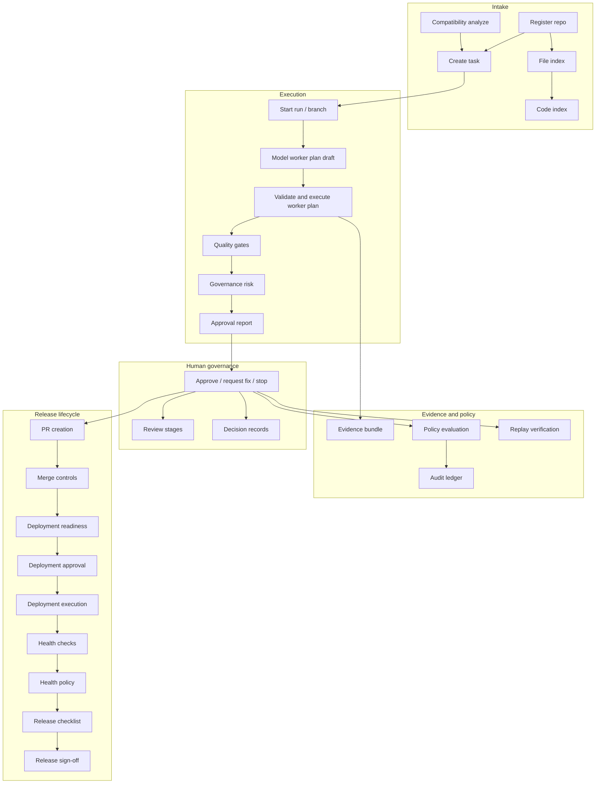

# Engineering Console — Current architecture

Snapshot of the VeraLux Engineering Console as implemented through Phase 8F (release sign-off). For operator procedures see [operator-runbook.md](./operator-runbook.md); for a walkthrough see [end-to-end-demo-script.md](./end-to-end-demo-script.md).

## System purpose

A **governed AI engineering control plane**: tasks and runs, model-assisted worker plan drafts, deterministic worker plan execution (only repo file-write boundary), quality gates, governance/policy/replay/evidence, human approval, and release lifecycle records (PR, merge, deploy, health, checklist, sign-off).

It is **not** autonomous coding, not a multi-repo IDE, and not auto-deploy by default.

## Stack

| Layer | Technology |
|-------|------------|
| UI | Next.js 15 App Router, React 19, Tailwind 4 |
| API | Next.js Route Handlers (`runtime = nodejs`) |
| Data | SQLite (`better-sqlite3`), WAL, foreign keys |
| Tests | Vitest (unit/integration under `src/lib/engineer-console`) |
| Models | Mock (default), Kimi (OpenAI-compatible HTTP) |

## Module map (`src/lib/engineer-console/`)

| Area | Path | Responsibility |
|------|------|----------------|
| Database | `db/` | Schema, client, init, bootstrap admin |
| Security | `security/` | Auth config, sessions, CSRF, route guards, roles |
| Tasks / runs | `task-manager/`, `run-manager/` | CRUD, run lifecycle fields |
| Workspace | `workspace/` | Git checkout, diff, controlled git for PR/merge |
| Orchestrator | `orchestrator/` | Start run, approval actions, worker plan submit |
| Worker plan | `worker-plan/` | Validate, execute UTF-8 file ops only |
| Model router | `model-router/` | Draft generation, providers, prompts |
| Quality gates | `quality-gates/` | Run repo `npm test` / build / lint when present |
| Approval | `approval/` | Approval report JSON |
| Governance | `governance/` | Audit ledger, evidence, decisions, replay, policy, review stages |
| Repo intelligence | `repo-intelligence/` | Register repos, file/code index, compatibility |
| Release | `release/` | PR, merge, deployment gates/execution, health, checklist, sign-off |
| Server | `server.ts` | `ensureEngineerConsoleReady()` — DB + config validation |

UI components: `src/components/engineer-console/*`  
Client fetch (CSRF): `src/lib/engineer-console-client/fetch.ts`

## UI routes

| Path | Purpose |
|------|---------|
| `/engineer` | Task list, create task |
| `/engineer/login` | Operator login (when auth enabled) |
| `/engineer/repos` | Register and index repositories |
| `/engineer/compatibility` | Cross-repo compatibility analysis |
| `/engineer/tasks/[id]` | Task detail, start run |
| `/engineer/runs/[id]` | Full run control plane (all panels) |

## Lifecycle diagram

## Database table map

| Table | Domain |
|-------|--------|
| `engineer_registered_repos`, `engineer_package_scripts`, `engineer_test_profiles` | Repo registration |
| `engineering_tasks`, `engineering_runs` | Work tracking |
| `quality_gate_results`, `approval_reports` | Run outcomes |
| `engineer_worker_plans`, `engineer_worker_operations`, `engineer_worker_plan_drafts` | Plans |
| `engineer_audit_events` | Append-only audit |
| `engineer_run_evidence_bundles` | Redacted evidence snapshots |
| `engineer_decision_records` | Human decisions |
| `engineer_file_index_runs`, `engineer_indexed_files` | File index |
| `engineer_code_index_runs`, `engineer_symbols`, `engineer_code_chunks` | Code index |
| `engineer_replay_verifications` | Replay verify runs |
| `engineer_governance_policies`, `engineer_governance_policy_results` | Policy |
| `engineer_api_surfaces`, `engineer_cross_repo_links`, `engineer_compatibility_analysis_runs` | Compatibility |
| `engineer_review_stages` | Review workflow |
| `engineer_pr_requests`, `engineer_merge_requests` | GitHub PR/merge records |
| `engineer_deployment_environments` | Environment catalog |
| `engineer_deployment_readiness_checks`, `engineer_deployment_approvals` | Deploy gates |
| `engineer_deployment_executions` | Profile execution records |
| `engineer_deployment_health_checks`, `engineer_deployment_health_policy_results` | Post-deploy health |
| `engineer_release_checklists` | Soft checklist evaluations |
| `engineer_release_signoffs` | Admin completion sign-off |
| `engineer_operator_accounts`, `engineer_operator_sessions` | Auth |

Schema source: `src/lib/engineer-console/db/schema.sql`

## API route map

Base: `/api/engineer-console`

### Auth

| Method | Path | Role |
|--------|------|------|
| POST | `/auth/login` | Public |
| POST | `/auth/logout` | Authenticated |
| GET | `/auth/me` | Authenticated |

### Tasks and runs

| Method | Path | Min role (mutation) |
|--------|------|---------------------|
| GET, POST | `/tasks` | operator |
| GET | `/tasks/[id]` | viewer |
| GET, POST | `/tasks/[id]/runs` | operator |
| GET | `/runs/[id]` | viewer |
| POST | `/runs/[id]/actions` | operator (approve → admin via assert) |
| POST | `/runs/[id]/worker-plan` | operator |
| POST | `/runs/[id]/worker-plan-drafts` | operator |
| GET | `/model-provider` | viewer |

### Governance (per run)

| Method | Path | Min role |
|--------|------|----------|
| GET | `/runs/[id]/audit-events` | viewer |
| GET | `/runs/[id]/evidence-bundle` | viewer |
| POST | `/runs/[id]/evidence-bundle/regenerate` | operator |
| GET | `/runs/[id]/decision-records` | viewer |
| GET, POST | `/runs/[id]/replay-verification` | operator |
| GET | `/runs/[id]/replay-package` | viewer |
| GET, POST | `/runs/[id]/policy-results` | operator |
| GET, POST | `/runs/[id]/review-stages` | viewer / operator |
| POST | `/runs/[id]/review-stages/generate` | operator |
| POST | `/runs/[id]/review-stages/[stageId]/actions` | operator (stage approve → admin) |

### Release (per run)

| Method | Path | Min role |
|--------|------|----------|
| GET, POST | `/runs/[id]/pr-readiness`, `/pr-requests` | viewer / **admin** POST |
| GET, POST | `/runs/[id]/merge-readiness`, `/merge-requests` | viewer / **admin** POST |
| GET, POST | `/runs/[id]/deployment-readiness` | viewer / operator |
| GET, POST | `/runs/[id]/deployment-approval` | viewer / **admin** |
| GET, POST | `/runs/[id]/deployment-executions` | viewer / **admin** |
| GET, POST | `/runs/[id]/deployment-health-checks` | viewer / operator |
| GET, POST | `/runs/[id]/deployment-health-policy` | viewer / operator |
| GET, POST | `/runs/[id]/release-checklist` | viewer / operator |
| GET, `/runs/[id]/release-signoffs` POST | viewer / **admin** |

### Repos and compatibility

| Method | Path | Min role |
|--------|------|----------|
| GET, POST | `/repos` | viewer / operator |
| GET, POST | `/repos/[id]/verify`, `/detect`, `/index`, `/code-index`, … | viewer / operator |
| POST | `/compatibility/analyze` | operator |
| GET | `/compatibility/surfaces`, `/links`, `/runs` | viewer |

### Deployment config (read-only metadata)

| GET | `/deployment/environments`, `/profiles`, `/health-profiles` | viewer |

### Audit verify

| GET | `/audit/verify` | viewer |

## Safety boundaries

| Boundary | Rule |
|----------|------|
| **Worker plan executor** | Only allowed file paths; create/update/append UTF-8; no delete, shell, or git commit |
| **Model draft** | JSON proposal only; never executes or writes disk |
| **Quality gates** | Run configured npm scripts in target repo after execution |
| **PR / merge** | Controlled `git` + `gh` only when human triggers; readiness gates first |
| **Deployment execution** | Admin only; fixed command from env profile; spawn with allowlisted args |
| **Health checks** | Operator; HTTP GET from profile URL; redacted summaries stored |
| **Release checklist** | DB-only advisory evaluation; no deploy |
| **Release sign-off** | Admin only; governance record; no deploy/rollback/CI |
| **Audit ledger** | Append-only hash chain |
| **Evidence / replay** | Redacted bundles; no full logs, diffs, or model I/O |

## What models can and cannot do

**Can**

- Generate worker plan draft JSON (mock or Kimi)
- Inform prompts with bounded repo context (symbols, compatibility summaries)

**Cannot**

- Sign off release completion
- Approve runs, review stages, deployments, or PRs
- Execute worker plans, shell, deployment profiles, or health checks
- Write files except via validated worker plan after operator submit
- Override `actorLabel` when auth is enabled

## What humans must approve

| Action | Minimum role |
|--------|----------------|
| Execute worker plan | operator |
| Final run approve | **admin** |
| Review stage approve | **admin** |
| Create PR | **admin** |
| Merge PR | **admin** |
| Deployment approval | **admin** |
| Deployment execution | **admin** |
| Release sign-off | **admin** |
| Deployment readiness / health / checklist evaluate | operator |
| Release checklist evaluate | operator |

Operators may request fix, stop, reject review stages, evaluate readiness, run health checks, and regenerate evidence.

## Future work (not implemented)

- Hard gates tying sign-off or checklist to deploy/merge
- Rollback controls and external CI correlation
- SSO / operator admin UI / multi-tenant RBAC
- `github_actions_future` deployment strategy execution
- Release notes generation
- Automated polling of health or deployment status
- Hosted HA database and horizontal scale

## Related deep-dive docs

- [audit-ledger.md](./audit-ledger.md), [evidence-bundles.md](./evidence-bundles.md), [replay-verification.md](./replay-verification.md)
- [deployment-gates.md](./deployment-gates.md), [release-checklist.md](./release-checklist.md), [release-signoff.md](./release-signoff.md)
- [security-auth.md](./security-auth.md), [env-reference.md](./env-reference.md)
