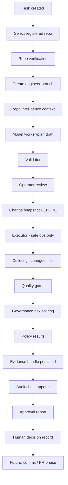

# Workspace Integration Audit — VeraLux Engineering Console

**Date:** 2026-05-23  
**Scope:** Read-only audit of three workspace repos; documentation only (no product code changes).  
**Author role:** Principal AI systems architect / migration engineer / governance release architect.

---

## Executive summary

The **VeraLux Engineering Console** is a governed AI engineering control plane with a mature **worker-plan safety boundary** (validate → operator review → limited executor → quality gates → governance → human approval). It must **not** become Vera Builder (multi-repo IDE with model filesystem tools) or Roundtable (deliberation product with org-scale SaaS surface).

**Donor strategy:**

| Donor | Role | Primary value |
|-------|------|----------------|
| **vera-builder** | Repo intelligence | Registration, indexing, test detection, rules, change snapshots (read-only patterns) |
| **Vera-Roundtable** | Governance | Append-only hash-chained audit ledger, replay verification, decision/review records, policy results |
| **Engineering Console** | Target | Extend existing task/run/worker-plan pipeline; do not duplicate IDE or model tool authority |

**Recommended next phase:** ~~Phase G1~~ **implemented** (`docs/audit-ledger.md`). ~~Phase 5A~~ **implemented** (`docs/registered-repos.md`). ~~Phase G2~~ **implemented** (`docs/evidence-bundles.md`). ~~Phase G3~~ **implemented** (`docs/decision-records.md`). ~~Phase 5B~~ **implemented** (`docs/file-index.md`). ~~Phase 5C~~ **implemented** (`docs/code-index.md`). ~~Phase G4~~ **implemented** (`docs/replay-verification.md`). ~~Phase G5~~ **implemented** (`docs/policy-results.md`). ~~Phase 5E~~ **implemented** (`docs/compatibility-analysis.md`). ~~Phase G6~~ **implemented** (`docs/review-stages.md`). ~~Phase 6~~ **implemented** (`docs/pr-creation.md`). Next: merge controls / deployment gates.

---

## Stage 0 — Workspace sanity check

| # | Question | Answer |
|---|----------|--------|
| 1 | VeraLux Engineering Console | `/Users/ndesantis/Documents/GitHub/Veralux-Engineering-Console` — `package.json` name `veralux-engineering-console`, README title "VeraLux Engineering Console", `src/lib/engineer-console/`, Next.js App Router under `src/app/(main)/engineer/` |
| 2 | Vera Builder (reference) | `/Users/ndesantis/Documents/GitHub/vera-builder` — README "Vera — Multi-Repo AI IDE", `server/` + Vite `src/`, `exports/engineering-console-transfer/` |
| 3 | Roundtable (reference) | `/Users/ndesantis/Documents/GitHub/Vera-Roundtable` — README "Roundtable AI", Next.js + Prisma, `src/lib/audit/`, `src/lib/review/`, `src/lib/policy/` |
| 4 | Ambiguity | **None.** All three repos are present and identifiable. Folder name `vera-builder` vs product name "Vera" is cosmetic only. |

**Note:** Workspace path labels may say "Vera Builder Reference" / "Roundtable Governance Reference"; on disk they are `vera-builder` and `Vera-Roundtable`.

---

## Stage 1 — VeraLux Engineering Console audit

### 1. Project stack

| Layer | Detail |
|-------|--------|
| Framework | Next.js 15 (App Router, Turbopack dev), React 19, TypeScript 5 |
| Styling | Tailwind CSS 4 |
| Database | SQLite via `better-sqlite3` (WAL, FK pragmas); path `ENGINEER_CONSOLE_DB_PATH` or `data/engineer-console.db` |
| Testing | Vitest 3 (`src/lib/engineer-console/**/*.test.ts`) |
| Model providers | Mock (default), Kimi (OpenAI-compatible); env `ENGINEER_CONSOLE_MODEL_PROVIDER`, `KIMI_*` |

Key files: `package.json`, `next.config.ts` (`serverExternalPackages: ["better-sqlite3"]`).

### 2. Routes / pages

| Route | File | Purpose |
|-------|------|---------|
| `/` | `src/app/page.tsx` | Landing → `/engineer` |
| `/engineer` | `src/app/(main)/engineer/page.tsx` | Task list (SSR) |
| `/engineer/tasks/[id]` | `src/app/(main)/engineer/tasks/[id]/page.tsx` | Task detail, start run |
| `/engineer/runs/[id]` | `src/app/(main)/engineer/runs/[id]/page.tsx` | Run detail: worker plan, gates, approval |

### 3. API routes

All under `/api/engineer-console/`, `runtime = "nodejs"`, **no authentication**.

| Method | Path | Behavior |
|--------|------|----------|
| GET, POST | `/tasks` | List / create tasks |
| GET | `/tasks/[id]` | Task detail |
| GET, POST | `/tasks/[id]/runs` | List runs; POST starts `executeRun` (async, fire-and-forget) |
| GET | `/runs/[id]` | Run + task + git diff + gates + approval + worker plan + draft |
| POST | `/runs/[id]/worker-plan` | Validate + execute worker plan |
| POST | `/runs/[id]/worker-plan-drafts` | Model draft only (no disk writes) |
| POST | `/runs/[id]/actions` | `approve` / `request_fix` / `stop` |
| GET | `/model-provider` | Public provider status (no secrets) |

### 4. Database / schema

File: `src/lib/engineer-console/db/schema.sql`

| Table | Role |
|-------|------|
| `engineering_tasks` | Work unit: title, `target_repo_path`, status, priority |
| `engineering_runs` | Execution instance per task: branch, step, model role, risk, governance notes |
| `quality_gate_results` | Per-run command results |
| `approval_reports` | 1:1 JSON report per run |
| `engineer_worker_plans` | Submitted plans + validation/execution status |
| `engineer_worker_operations` | Per-operation audit rows |
| `engineer_worker_plan_drafts` | Model drafts (prompt, raw response, parsed JSON) |

Init: `db/init.ts` runs `CREATE IF NOT EXISTS` only — **no versioned migrations**.

### 5. Task / run model

- **Types:** `src/lib/engineer-console/types.ts`
- **Task manager:** `task-manager/task-manager.ts`
- **Run manager:** `run-manager/run-manager.ts` (gates, approval persistence)
- **Default orchestration:** `orchestrator/run-orchestrator.ts` — branch → stub agent → governance → gates → approval
- **Worker-plan orchestration:** `orchestrator/worker-plan-orchestrator.ts` — separate path; does not call default stub agent

**Dual-path fragility:** "Start run" uses stub agent (`agent-worker/agent-worker.ts`) and often produces **no file changes** unless operator submits a worker plan. Run status enums include worker-plan steps the default path may never set.

### 6. Worker plan schema

`worker-plan/worker-plan-types.ts` — JSON: `runId`, `summary`, `allowedFiles[]`, `operations[]` with `type`, `path`, `content`, `reason`.

**Allowed ops:** `create_file`, `update_file`, `append_file` only.

### 7. Worker plan validator

`worker-plan/worker-plan-validation.ts`

- Rejects forbidden types (`delete_*`, `exec`, `shell`, etc.)
- `runId` must match engineering run
- Every operation path must be in `allowedFiles`
- Delegates to `path-safety.ts` for traversal and protected paths
- Duplicate paths: warning only (last op wins)

### 8. Worker plan executor

`worker-plan/worker-plan-executor.ts`

- UTF-8 writes only; creates parent dirs for `create_file`
- No delete, shell, or git commit
- Re-checks resolved absolute path vs validation
- Partial failure: earlier ops remain on disk; `success: false` if any error

### 9. Model draft / provider layer

`model-router/` — `generateAndPersistWorkerPlanDraft`: repo context → LLM JSON → parse → **validate only** → persist draft. Operator must POST worker-plan to execute.

- `repo-context-collector.ts` — bounded read-only tree (skips `.git`, `node_modules`, `.env`; byte limits)
- Providers: `mock-model-provider.ts`, `kimi-model-provider.ts`

### 10. Quality gate runner

`quality-gates/quality-gate-runner.ts` — auto-detects `npm test`, `build`, `lint`, `typecheck` from target `package.json`; `child_process.exec` in repo cwd (10 min timeout). **Human/gate-controlled execution**, not model tools.

### 11. Governance / risk scoring

`governance/governance-engine.ts` — post-hoc on git `changedFiles`: blocks `.env`, `.git`, `node_modules`; high risk for `package-lock.json`, `migrations/` (overridable); medium if >20 files. Sets `canApprove` for approval layer.

### 12. Approval report flow

`approval/approval-report.ts` — `canApprove` requires governance OK + gates passed/skipped + run `waiting_for_approval`.  
`run-orchestrator.ts` `handleApprovalAction` — state updates only (no commit/deploy).

### 13. Current tests

**16 Vitest files, 58 tests** (all passed at audit time). Coverage: worker-plan validation/executor, orchestrator integration, governance, approval, quality gates, model-router, git workspace, task manager. **No app/API/component tests.**

### 14. Current docs

| Doc | Path |
|-----|------|
| MVP architecture & safety | `docs/engineer-console-mvp.md` |
| Quick start | `README.md` |
| This audit | `docs/workspace-integration-audit.md` |

### 15. Safety boundaries (must not weaken)

| Boundary | Implementation |
|----------|----------------|
| Model authority | Draft JSON only; no auto-execute on draft |
| Path safety | `worker-plan/path-safety.ts` — no `..`, no absolute paths, prefix under repo root |
| Protected paths | `.env*`, `.git`, `node_modules`, optional `package-lock.json`, `migrations/` |
| Allowlist | All operation paths ∈ `allowedFiles` |
| Executor | Three write ops only |
| Governance | Second pass on actual changed files |
| Approval | Human action required; no autonomous approve |

**Gaps (trust assumptions):**

- Tasks accept arbitrary `targetRepoPath` → local read/write + gate `exec`
- No API auth (localhost/trusted network only)
- Draft API may return `rawResponse` (sensitive context leakage risk)
- No change snapshots / audit chain yet
- SQLite singleton not multi-instance safe

### 16. What Engineering Console already has — do not duplicate

| Capability | Status |
|------------|--------|
| Task/run lifecycle | ✅ Keep; extend with audit + repo registry |
| Worker-plan validator/executor | ✅ **Sacred** — do not replace with model tools |
| Model draft pipeline | ✅ Keep; tighten redaction in later phases |
| Quality gates | ✅ Keep; later align with `engineer_test_profiles` |
| Basic governance scoring | ✅ Keep; later add policy results + audit |
| Git branch workspace | ✅ `workspace/git-workspace.ts` — read/status/diff; no PR automation |
| Approval reports | ✅ Keep; link to evidence bundles in G2 |

**Do not build in Console:** Monaco IDE, chat tool loops, terminal panel, agent orchestrator, multi-repo fusion, template generation, PR push without approval maturity.

---

## Stage 2 — Vera Builder reference audit

Vera Builder is a **multi-repo AI IDE** (Express + Vite + SQLite). Its value to the Console is **repo intelligence** and **negative examples** of model authority.

### Module inventory

#### repo-manager

| Field | Value |
|-------|-------|
| Path | `server/services/repo-manager.ts`, `server/routes/repos.ts` |
| Purpose | Register/list/remove local repos; language hints from manifests |
| Deps | `better-sqlite3`, `fs`, `path` |
| FS access | Read-only manifest probes |
| External commands | None |
| Model authority | Indirect (tools resolve repo by name) |
| Safe to adapt | **Yes** (with path allowlist + verification) |
| Recommendation | **Partial copy** → `repo-intelligence/registered-repos/` (Phase 5A) |

#### indexer

| Field | Value |
|-------|-------|
| Path | `server/services/indexer.ts`, `server/routes/search.ts` |
| Purpose | Glob scan → file metadata → regex symbols → 60-line chunks → DB search |
| Deps | `glob`, `crypto`, `db`, `fs` |
| FS access | Read-only; `IGNORED_DIRS`, `CODE_EXTENSIONS`, max 512KB/file |
| Model authority | `search_code` / `search_symbols` in `ai.ts` (read-only DB) |
| Safe to adapt | **Partial** — harden secret denylist; no model-triggered index |
| Recommendation | **Partial copy** → `file-index/`, `symbol-index/`, `chunk-index/` (5B–5C) |

#### compatibility

| Field | Value |
|-------|-------|
| Path | `server/services/compatibility.ts`, `server/routes/compatibility.ts` |
| Purpose | Cross-repo deps, REST/events/symbols → `api_surfaces`, `cross_repo_links` |
| FS access | Read manifests + source (regex) |
| Model authority | None |
| Recommendation | **Reference** now; **partial copy** Phase 5E |

#### test-runner

| Field | Value |
|-------|-------|
| Path | `server/services/test-runner.ts`, `server/routes/test-runner.ts` |
| Purpose | `detectTestRunner()`; `runTestsForRepo()` via `execSync` (120s) |
| Model authority | **High** via `run_command` tool + tester agent |
| Recommendation | **Partial copy** — `detectTestRunner` only → `test-detection/`; **do not migrate** execution routes |

#### change-tracker

| Field | Value |
|-------|-------|
| Path | `server/services/change-tracker.ts`, `server/routes/changes.ts` |
| Purpose | Before/after snapshots; timeline; **revert writes disk** |
| Gap | `captureBeforeChange` / `captureAfterChange` **not wired** to AI writes |
| Recommendation | **Partial copy** → hook **worker-plan executor** (Phase 5D); revert = explicit human rollback only |

#### rules

| Field | Value |
|-------|-------|
| Path | `server/services/rules.ts`, `server/routes/rules.ts` |
| Purpose | CRUD + `checkRules()` over index/compatibility |
| Types | `version_match`, `api_coverage`, `naming_convention`, `required_exports`, `no_direct_dependency` |
| Recommendation | **Partial copy** → governance/policy signals (Phase 5F), not sole gate |

#### agent / ai / orchestrator

| Module | Path | Model authority | Recommendation |
|--------|------|-----------------|----------------|
| AI chat + tools | `server/services/ai.ts` | `read_file`, `write_file`, `create_file`, `delete_file`, `run_command`, `spawn_subagent`, git tools, search | **Do not migrate** tools; **reference** `gatherContext()` → bounded `prompt-context/` |
| Background agents | `server/services/agent.ts` | Full tool suite via `streamChat` | **Do not migrate** |
| Orchestrator | `server/services/orchestrator.ts` | LLM planner → parallel subagents with tools | **Reference** only; **rewrite** against worker plans |

**`ai.ts` tool risk summary:**

| Tool | Risk |
|------|------|
| `write_file` / `create_file` / `delete_file` | Bypass worker-plan governance |
| `run_command` | Arbitrary shell in repo cwd (30s) — **RCE** |
| `read_file` | No traversal guard; can read secrets |
| `spawn_subagent` | Parallel ungoverned writers |

#### repo-fusion / template-builder

| Module | Path | Recommendation |
|--------|------|----------------|
| repo-fusion | `server/services/repo-fusion.ts`, `routes/fusion.ts` | **Do not migrate** — multi-repo merge execution |
| template-builder | `server/services/template-builder.ts`, `routes/templates.ts` | **Do not migrate** — tenant generation writes trees |

#### Routes summary

| Route | Risk | Recommendation |
|-------|------|----------------|
| `repos.ts` | Low (with verification) | Partial 5A |
| `search.ts` | Read DB | Internal prompt-context API only |
| `files.ts` | Write/delete | Do not migrate write/delete |
| `terminal.ts` | Arbitrary `exec` | **Do not migrate** |
| `agent.ts`, `chat.ts` | Full AI tools | **Do not migrate** |
| `pr.ts` | `git push`, `gh pr create` | Rewrite Phase 6 (approval-gated) |
| `git.ts` | commit/add | Reference read ops only |
| `test-runner.ts` | exec | Detection only |
| `changes.ts` | revert writes | Snapshots partial; gated revert |

#### UI shell (reference only)

Monaco (`CodeEditor`, `EditorArea`), `TerminalPanel`, `ChatPanel`, `AgentPanel`, `PrCreator`, `RepoFusion`, `TemplateBuilder` — **do not migrate**. Optional UX reference: `RepoList`, `SearchPanel`, `RulesPanel`, `ChangeTimeline` (gated).

#### Transfer pack (vera-builder)

`exports/engineering-console-transfer/` — pre-drafted `COMPONENT_MAP.md`, `REPO_INTELLIGENCE_DESIGN.md`, `DATA_MODEL_CANDIDATES.md`, `SECURITY_BOUNDARY_NOTES.md`, `SERVICE_EXTRACTION_PLAN.md`. **Aligned with code audit**; use as implementation prompts, not runtime dependencies.

---

## Stage 3 — Roundtable governance reference audit

Roundtable is **governed decision intelligence** (Next.js + Prisma/PostgreSQL). Backend governance patterns are the donor; deliberation theater UI is not.

### Core audit chain (Phase G1 primary donor)

| Field | Value |
|-------|-------|
| Path | `src/lib/audit/audit-integrity.ts` |
| Tests | `src/lib/audit/audit-integrity-concurrency.test.ts` |
| DB table | `AuditIntegrityEvent` (Prisma) — append-only, org-scoped |
| Purpose | Tamper-evident hash chain per organization |
| Hash logic | `computeAuditChainHash(prev, payloadHash, eventType, entityId)` — SHA-256 |
| Payload hashing | `hashAuditPayload()` in `src/lib/provenance/signing/provenance-signing.ts` |
| Verification | `verifyAuditIntegrityChain()` — continuity, recomputed hash, duplicate previous/chain head (fork detection) |
| Concurrency | `pg_advisory_xact_lock` per org inside Prisma transaction |
| Genesis | `AUDIT_CHAIN_GENESIS = "GENESIS"` |
| Recommendation | **Rewrite** for SQLite + Console scope (single-tenant or `workspace_id`); **do not copy** Postgres advisory locks verbatim |

**Adaptation note:** Engineering Console uses SQLite — replace advisory locks with `BEGIN IMMEDIATE` transaction + single-writer discipline or application mutex per chain scope.

### Replay / verification

| Module | Path | Purpose |
|--------|------|---------|
| Replay integrity | `src/lib/policy/replay-integrity.ts` | Provenance signature + audit chain check for session |
| Replay export | `src/lib/audit/export/replay-package.ts` | Auditor JSON bundle |
| Provenance signing | `src/lib/provenance/signing/provenance-signing.ts` | HMAC optional signing |
| Provenance snapshot | `src/lib/provenance/provenance-snapshot.ts` | Session graph hash + audit link |

**Recommendation:** Phase G4 — adapt verification to Console runs (worker plan hash, gate results, approval report hash) without full Roundtable session provenance graph.

### Decision records & human review

| Module | Path | DB | Recommendation |
|--------|------|-----|----------------|
| Review engine | `src/lib/review/review-engine.ts` | `DecisionReview` | **Rewrite** — map to `engineer_decision_records` + run approval |
| Review workflows | `src/lib/review/review-workflows.ts` | `DecisionReviewAction` | **Partial** — action types + audit append pattern |
| Review triggers | `src/lib/review/review-triggers.ts` | — | **Reference** — auto-queue rules (adapt to risk/governance) |
| Review close rules | `src/lib/review/review-close-rules.ts` | — | **Reference** — prevent invalid close transitions |

### Governance policy

| Module | Path | Purpose |
|--------|------|---------|
| Policy engine | `src/lib/policy/policy-engine.ts` | Resolve org policy version + hash |
| Policy evaluator | `src/lib/policy/policy-evaluator.ts` | Enforce rules on actions |
| Policy types/versioning | `src/lib/policy/policy-types.ts`, `policy-versioning.ts` | Canonical JSON + hash |
| Tests | `src/lib/policy/phase6b-enterprise.test.ts` | Enterprise policy scenarios |

**Recommendation:** Phase G5 — store `engineer_governance_policy_results` per run; keep Console `governance-engine.ts` as fast path, policies as configurable overlay.

### Context / resilience audit wrappers

| Module | Path | Pattern |
|--------|------|---------|
| Context audit | `src/lib/context/context-audit.ts` | Thin wrapper → `appendAuditIntegrityEvent` |
| Resilience audit | `src/lib/resilience/resilience-audit.ts` | Same pattern |
| Model control audit | `src/lib/roundtable/admin/model-control-audit.ts` | Roster/session events |

**Recommendation:** **Reference** event-type naming discipline; Console should define `ENGINEER_AUDIT.*` constants.

### Vector delivery timeline (secondary hash-chain pattern)

| Module | Path | Note |
|--------|------|------|
| Timeline hash | `src/lib/context/vector/delivery/timeline/vector-delivery-timeline-hash.ts` | Similar chained hash for delivery events |
| Timeline | `vector-delivery-timeline.ts` | Domain-specific; **reference only** for Engineering Console |

### Presentation / theater (do not migrate as governance)

| Module | Path | Value |
|--------|------|-------|
| Deliberation theater | `src/lib/deliberation-visualization/deliberation-theater-types.ts` | **Presentation only** — stage seats, tension edges |
| Executive report PDF | `src/lib/roundtable/report/*` | Branding/decision record PDFs — not Console scope |
| Stage step-through | `deliberation-visualization/stage-step-through.ts` | Marketing copy for deliberation UX |

**Rule:** Implement **audit ledger + evidence bundles + decision records** before any timeline/theater UI.

### Roundtable governance tests to reference

- `src/lib/audit/audit-integrity-concurrency.test.ts` — fork safety under concurrent appends
- `src/lib/policy/phase6b-enterprise.test.ts` — policy versioning
- `src/lib/roundtable/phase16a-governance.test.ts` — broader governance integration
- `src/lib/review/phase7b-review-operations.test.ts` — review lifecycle

---

## Stage 4 — Classification table

### A. Safe to adapt soon

| Source repo | Source path | Concept | Why it matters | Risk | Adaptation | Target in Console | Notes |
|-------------|-------------|---------|--------------|------|------------|-------------------|-------|
| Roundtable | `src/lib/audit/audit-integrity.ts` | Append-only hash chain | Tamper-evident operator trail | Low | Rewrite (SQLite) | `governance/audit-ledger/` | Phase G1 |
| Roundtable | `provenance-signing.ts` `hashAuditPayload` | Payload hashing | Stable chain input | Low | Partial copy | `audit-ledger/hash.ts` | Truncate/hash policy aligned with RT |
| vera-builder | `server/services/repo-manager.ts` | Repo registration | Replace free-text `target_repo_path` | Low | Partial copy | `repo-intelligence/registered-repos/` | Phase 5A |
| vera-builder | `test-runner.ts` `detectTestRunner` | Test profile detection | Gate hints without model exec | Low | Partial copy | `repo-intelligence/test-detection/` | Phase 5A |
| vera-builder | `repo-manager.ts` + package read | Package script detection | Quality gate / prompt context | Low | Partial copy | `repo-intelligence/package-scripts/` | Phase 5A |
| EC | `repo-context-collector.ts` | Safe tree scan | Already bounded; extend with registry | Low | Extend | `repo-intelligence/prompt-context/` | Tie to registered repos |
| vera-builder | `indexer.ts` constants | Ignore dirs / extensions | Prevent secret indexing | Low | Partial copy | `file-index/policy.ts` | Before 5B indexing |
| Roundtable | Review audit append pattern | Decision audit events | Links human actions to chain | Low | Rewrite | `governance/decision-records/` | Phase G3 |

### B. Useful later

| Source repo | Source path | Concept | Risk | Adaptation | Target | Phase |
|-------------|-------------|---------|------|------------|--------|-------|
| vera-builder | `indexer.ts` | File/symbol/chunk index | Medium | Partial copy | `file-index/`, `symbol-index/`, `chunk-index/` | 5B–5C |
| vera-builder | `compatibility.ts` | API surface / cross-repo links | Medium | Partial copy | `compatibility/` | 5E |
| vera-builder | `rules.ts` | Repo rules engine | Medium | Partial copy | Extend `governance/` | 5F |
| vera-builder | `change-tracker.ts` | Change snapshots | Medium | Partial copy | `change-snapshots/` | 5D |
| Roundtable | `replay-integrity.ts` | Replay verification | Medium | Rewrite | `governance/audit-ledger/verify.ts` | G4 |
| Roundtable | `policy-engine.ts` | Versioned policies | Medium | Rewrite | `governance/policy-results/` | G5 |
| Roundtable | `review-engine.ts` | Review stages / routing | Medium | Rewrite | `governance/review-stages/` | G6 |
| vera-builder | `SearchPanel`, `RepoMap` | Intelligence dashboards | Low | Reference | UI (later) | Post-G6 |

### C. Do not migrate

| Source repo | Source path | Concept | Risk | Reason |
|-------------|-------------|---------|------|--------|
| vera-builder | `server/services/ai.ts` tools | Model FS/shell authority | **Blocked** | Collapses worker-plan boundary |
| vera-builder | `routes/terminal.ts` | Arbitrary terminal | **Blocked** | RCE equivalent to `run_command` |
| vera-builder | `ChatPanel`, `AgentPanel` | Tool-loop chat | High | Not a control plane |
| vera-builder | Monaco shell | Full IDE | High | Console is not an IDE |
| vera-builder | `repo-fusion.ts` execute | Repo merge execution | High | Out of scope |
| vera-builder | `template-builder.ts` generate | Tenant file generation | High | Execution, not intelligence |
| vera-builder | `orchestrator.ts` | Parallel subagents | High | Ungoverned writers |
| Roundtable | `deliberation-theater-types.ts` | Theater UI | Low product value | Theater without ledger misleads |
| Roundtable | Executive PDF/report theater | Presentation | Low | Not operator engineering UX |
| EC | — | Autonomous approve/commit/PR | **Blocked** | Explicit non-goals |

### D. Requires redesign before reuse

| Source repo | Source path | Concept | Risk | Redesign notes |
|-------------|-------------|---------|------|----------------|
| vera-builder | `ai.ts` `gatherContext` | Prompt context | Medium | Bounded, redacted, no tool loop → `prompt-context/assemble.ts` |
| vera-builder | `routes/pr.ts` | PR creation | High | Only after approval + audit + dry-run default |
| vera-builder | `test-runner.ts` run | Test execution | High | Console gates already exec — unify with profiles + audit |
| vera-builder | `agent.ts` | Background agents | High | Map to task/run + worker plans only |
| Roundtable | `review-workflows.ts` full | Multi-stage review | Medium | Map to engineering run types, not session deliberation |
| Roundtable | Org/multi-tenant model | `organizationId` scope | Medium | Console may use `workspace_id` or single-tenant chain |

---

## Stage 5 — Target architecture recommendation

### Proposed module layout

```
src/lib/engineer-console/
  repo-intelligence/
    registered-repos/       # CRUD, verification, allowlist paths
    repo-verification/      # exists, is git, readable, not denied
    package-scripts/        # package.json script table
    test-detection/         # vitest/jest/pytest/... profiles
    file-index/             # Phase 5B — safe glob scanner
    symbol-index/           # Phase 5C — regex symbols (no AST v1)
    chunk-index/            # Phase 5C — line chunks for search
    prompt-context/         # Bounded context for model drafts
    compatibility/          # Phase 5E — api surfaces, cross-repo links
  governance/
    risk-scoring/           # Existing governance-engine (extend)
    audit-ledger/           # G1 — append events, hash chain, verify
    evidence-bundles/       # G2 — run snapshot: plan, gates, diff, hashes
    decision-records/       # G3 — human approve/request_fix/stop + actor
    policy-results/         # G5 — versioned policy evaluation per run
    review-stages/          # G6 — architecture / implementation / risky diff
```

### End-to-end workflow (target state)



**Invariant:** Every box after `DRAFT` that mutates disk or executes commands is **server-controlled**, never model-initiated. Models stop at `DRAFT`.

---

## Stage 6 — Phase roadmap

### Phase 4 — Real model provider integration

| Field | Detail |
|-------|--------|
| Goal | Production-grade provider routing (if gaps remain beyond Kimi/mock) |
| Donor | EC `model-router/`; vera-builder `ai.ts` **reference only** for provider config patterns |
| Target files | `model-router/providers/*`, `model-provider-config.ts` |
| Risk | Medium (secrets, timeouts) |
| Tests | Provider contract tests, draft generator integration |
| Acceptance | Draft generation works with configured provider; no new write authority |
| Non-goals | Tool calling, multi-provider chat UI |

**Status at audit:** Mock + Kimi exist; treat as **complete enough for MVP** unless production requires additional providers.

---

### Phase G1 — Append-only audit ledger

| Field | Detail |
|-------|--------|
| Goal | Tamper-evident event chain for task/run/worker-plan/approval lifecycle |
| Donor | Roundtable `audit-integrity.ts`, `hashAuditPayload` |
| Target | `governance/audit-ledger/*`, schema `engineer_audit_events` |
| Risk | Low–medium (SQLite concurrency) |
| Tests | Chain append, verify, concurrent append, tamper detection |
| Acceptance | Events append on key transitions; `verifyAuditChain(scope)` returns ok/failures |
| Non-goals | PR, commits, review stages UI, theater |

---

### Phase 5A — Registered repos + package script/test profile detection

| Field | Detail |
|-------|--------|
| Goal | Replace ad-hoc `target_repo_path` with verified registry + detection metadata |
| Donor | vera-builder `repo-manager.ts`, `test-runner.ts` detection |
| Target | `repo-intelligence/registered-repos/`, `package-scripts/`, `test-detection/` |
| Risk | Low (read-only) |
| Tests | Registration, verification failures, script/profile detection |
| Acceptance | API + UI list repos; task can reference registered repo; profiles stored |
| Non-goals | Full index, symbol search, model FS access, PR |

---

### Phase G2 — Evidence bundles

| Field | Detail |
|-------|--------|
| Goal | Immutable-ish run evidence package (hashes of plan, gates, diff summary) |
| Donor | Roundtable `replay-package.ts` pattern; EC approval report |
| Target | `governance/evidence-bundles/`, `engineer_run_evidence_bundles` |
| Risk | Medium (PII in bundles — redact) |
| Tests | Bundle create on run complete; hash stable |
| Acceptance | One bundle per run awaiting approval; linked from approval report |
| Non-goals | External auditor portal |

---

### Phase 5B — File index + safe tree scanner

| Field | Detail |
|-------|--------|
| Goal | Indexed file metadata for prompt context and governance |
| Donor | vera-builder `indexer.ts` scan half |
| Target | `repo-intelligence/file-index/` |
| Risk | Medium (secret paths) |
| Tests | Ignore policy, max size, relative paths only in API |
| Acceptance | Index job per repo; no model-triggered index endpoint |
| Non-goals | Vector embeddings v1 |

---

### Phase G3 — Human decision records

| Field | Detail |
|-------|--------|
| Goal | Structured approve/request_fix/stop with actor + rationale |
| Donor | Roundtable `DecisionReview`, `DecisionReviewAction` |
| Target | `governance/decision-records/`, `engineer_decision_records` |
| Risk | Low |
| Tests | State transitions, audit events on each action |
| Acceptance | Decision row per final human action; audit chain links |
| Non-goals | Autonomous approval |

---

### Phase 5C — Symbol/chunk indexing

| Field | Detail |
|-------|--------|
| Goal | Searchable symbols/chunks for prompt-context assembly |
| Donor | vera-builder `indexer.ts` |
| Target | `symbol-index/`, `chunk-index/` |
| Risk | Medium |
| Tests | Symbol extraction, chunk boundaries, search limits |
| Acceptance | Internal API for prompt builder only |
| Non-goals | Model-facing search tools |

---

### Phase G4 — Audit verification / replay

| Field | Detail |
|-------|--------|
| Goal | Verify chain + recompute evidence hashes for a run |
| Donor | Roundtable `verifyReplayIntegrity`, `verifyAuditIntegrityChain` |
| Target | `governance/audit-ledger/verify.ts` |
| Risk | Medium |
| Tests | Tampered row detection; full run replay package export |
| Acceptance | CLI/API `verify-run/{id}` for operators |
| Non-goals | Full deliberation replay |

---

### Phase 5D — Change snapshots before worker execution

| Field | Detail |
|-------|--------|
| Goal | Per-file before snapshot tied to worker-plan operation index |
| Donor | vera-builder `change-tracker.ts` |
| Target | `change-snapshots/` + executor hooks |
| Risk | Medium |
| Tests | Snapshot before execute; no snapshot on failed validation |
| Acceptance | Revert is explicit operator action with audit event |
| Non-goals | Auto-revert on gate failure (defer) |

---

### Phase G5 — Governance policy results

| Field | Detail |
|-------|--------|
| Goal | Versioned policy evaluation stored per run |
| Donor | Roundtable `policy-engine.ts`, `policy-evaluator.ts` |
| Target | `governance/policy-results/` |
| Risk | Medium |
| Tests | Policy version hash, pass/fail/warn records |
| Acceptance | `engineer_governance_policy_results` linked to run |
| Non-goals | Full enterprise policy UI |

---

### Phase 5E — Compatibility / API surface analysis

| Field | Detail |
|-------|--------|
| Goal | Cross-repo dependency and API surface warnings in approval report |
| Donor | vera-builder `compatibility.ts` |
| Target | `repo-intelligence/compatibility/` |
| Risk | Medium |
| Tests | Detector unit tests on fixtures |
| Acceptance | Warnings surface in governance/approval JSON |
| Non-goals | Auto-fix breaking changes |

---

### Phase G6 — Review stages (**implemented**)

| Field | Detail |
|-------|--------|
| Goal | Human review stages: architecture / implementation / risky diff / release readiness |
| Donor | Roundtable review routing concepts (backend-only) |
| Target | `governance/review-stages/` — see `docs/review-stages.md` |
| Risk | Medium |
| Tests | Stage transitions, blocking approve until stages complete |
| Acceptance | High-risk runs require stage sign-off before final approve |
| Non-goals | Deliberation theater UI |

---

### Phase 6 — PR creation (**implemented**)

| Field | Detail |
|-------|--------|
| Goal | Approval-gated commit + draft GitHub PR via controlled git/gh |
| Donor | vera-builder `routes/pr.ts` concepts only (redesigned) |
| Target | `release/pr-creation/` — see `docs/pr-creation.md` |
| Risk | **High** (mitigated by readiness gates + allowlisted commands) |
| Tests | Readiness, commit allowlist, PR body redaction, audit events |
| Acceptance | Blocked runs cannot create PRs; governed runs can open draft PR |
| Non-goals | Auto-merge, deploy, model-triggered PRs |

---

## Stage 7 — Data model candidates

Adapted for SQLite; link to existing `engineering_tasks`, `engineering_runs`, `engineer_worker_plans`. Do not blind-copy Vera or Roundtable schemas.

### Repo intelligence

#### `engineer_registered_repos` (Phase 5A)

| Column | Type | Notes |
|--------|------|-------|
| `id` | TEXT PK | UUID |
| `name` | TEXT UNIQUE | Display name |
| `path` | TEXT UNIQUE | Absolute server path |
| `description` | TEXT | |
| `language` | TEXT | Hint from manifests |
| `verification_status` | TEXT | `pending`, `ok`, `missing`, `denied` |
| `verification_message` | TEXT | |
| `verified_at` | TEXT | |
| `file_count` | INTEGER | Updated after index |
| `indexed_at` | TEXT NULL | |
| `created_at`, `updated_at` | TEXT | |

**Relationships:** Optional FK from `engineering_tasks.registered_repo_id`.  
**Donor:** Vera `repos` + verification fields from transfer pack.  
**Migration risk:** Low.

#### `engineer_package_scripts` (Phase 5A)

| Column | Type | Notes |
|--------|------|-------|
| `id` | TEXT PK | |
| `repo_id` | TEXT FK | |
| `script_name` | TEXT | `test`, `build`, … |
| `command` | TEXT | |
| `source_file` | TEXT | `package.json` |
| `detected_at` | TEXT | |

**Relationships:** Used by prompt-context and quality gate hints.  
**Donor:** Logic from vera-builder package reads.  
**Migration risk:** Low.

#### `engineer_test_profiles` (Phase 5A)

| Column | Type | Notes |
|--------|------|-------|
| `id` | TEXT PK | |
| `repo_id` | TEXT FK UNIQUE | One active profile per repo |
| `runner` | TEXT | `vitest`, `jest`, `pytest`, … |
| `detect_command` | TEXT | Suggested only |
| `confidence` | TEXT | |
| `signals_json` | TEXT | |
| `detected_at` | TEXT | |

**Donor:** `test-runner.detectTestRunner()`.  
**Migration risk:** Low.

#### `engineer_indexed_files` (Phase 5B)

| Column | Type | Notes |
|--------|------|-------|
| `id` | TEXT PK | |
| `repo_id` | TEXT FK | |
| `relative_path` | TEXT | **No absolute paths in API** |
| `language`, `size`, `content_hash` | | |
| `indexed_at` | TEXT | |

**Donor:** Vera `files`.  
**Migration risk:** Medium (path leakage).

#### `engineer_symbols` (Phase 5C)

| Column | Type | Notes |
|--------|------|-------|
| `id` | TEXT PK | |
| `file_id`, `repo_id` | TEXT FK | |
| `name`, `kind`, `line`, `signature`, `exported` | | |

**Donor:** Vera `symbols`.

#### `engineer_code_chunks` (Phase 5C)

| Column | Type | Notes |
|--------|------|-------|
| `id` | TEXT PK | |
| `file_id`, `repo_id` | TEXT FK | |
| `start_line`, `end_line`, `content`, `content_hash` | | |

**Donor:** Vera `chunks`.

#### `engineer_api_surfaces` / `engineer_cross_repo_links` (Phase 5E)

**Donor:** Vera `api_surfaces`, `cross_repo_links`.  
**Migration risk:** Medium — requires multi-repo registration.

### Governance

#### `engineer_audit_events` (Phase G1)

| Column | Type | Notes |
|--------|------|-------|
| `id` | TEXT PK | |
| `chain_scope` | TEXT | e.g. `workspace` or `org_id` |
| `event_type` | TEXT | `TASK_CREATED`, `RUN_STARTED`, … |
| `entity_type` | TEXT | `TASK`, `RUN`, `WORKER_PLAN`, … |
| `entity_id` | TEXT | |
| `actor_id` | TEXT NULL | Operator id when auth exists |
| `payload_hash` | TEXT | SHA-256 truncated |
| `previous_event_hash` | TEXT NULL | |
| `chain_hash` | TEXT | |
| `created_at` | TEXT | |

**Relationships:** `entity_id` references tasks/runs/plans.  
**Donor:** Roundtable `AuditIntegrityEvent`.  
**Migration risk:** Low–medium (concurrency).

#### `engineer_audit_integrity_checks` (Phase G4)

| Column | Type | Notes |
|--------|------|-------|
| `id` | TEXT PK | |
| `chain_scope` | TEXT | |
| `checked_at` | TEXT | |
| `ok` | INTEGER | |
| `failures_json` | TEXT | |

#### `engineer_run_evidence_bundles` (Phase G2)

| Column | Type | Notes |
|--------|------|-------|
| `id` | TEXT PK | |
| `run_id` | TEXT FK UNIQUE | |
| `bundle_hash` | TEXT | |
| `bundle_json` | TEXT | Redacted snapshot |
| `created_at` | TEXT | |

**Contents (hashed):** worker plan summary, validation result, gate summaries, governance assessment, changed files list, git diff stat (not full secret-bearing diff).

#### `engineer_decision_records` (Phase G3)

| Column | Type | Notes |
|--------|------|-------|
| `id` | TEXT PK | |
| `run_id` | TEXT FK | |
| `decision` | TEXT | `approved`, `request_fix`, `stopped` |
| `actor_id` | TEXT NULL | |
| `rationale` | TEXT | |
| `created_at` | TEXT | |

**Donor:** Roundtable `DecisionReview` + `DecisionReviewAction` (simplified).

#### `engineer_governance_policies` / `engineer_governance_policy_results` (Phase G5)

**Donor:** Roundtable `OrganizationPolicy`. Store `policy_version`, `policy_hash`, `results_json` per run.

#### `engineer_change_snapshots` (Phase 5D)

| Column | Type | Notes |
|--------|------|-------|
| `id` | TEXT PK | |
| `run_id` | TEXT FK | |
| `worker_plan_id` | TEXT FK | |
| `operation_index` | INTEGER | |
| `relative_path` | TEXT | |
| `snapshot_kind` | TEXT | `before`, `after` |
| `content_hash` | TEXT | |
| `storage_ref` | TEXT | Blob path or inline hash-only |
| `created_at` | TEXT | |

**Donor:** Vera `change_snapshots` — wire to executor, not AI tools.

#### `engineer_review_stages` (Phase G6 — implemented)

| Column | Type | Notes |
|--------|------|-------|
| `id` | TEXT PK | |
| `run_id` | TEXT FK | |
| `task_id` | TEXT | |
| `stage` | TEXT | `architecture_review`, `implementation_review`, `risky_diff_review`, `release_readiness_review` |
| `status` | TEXT | `pending`, `approved`, `rejected`, `skipped` |
| `required` | INTEGER | 1 = blocks final approve until approved |
| `reason`, reviewer fields, evidence/policy/audit refs, timestamps | | See `schema.sql` |

---

## Stage 8 — Security boundary analysis

### 1. Why Vera Builder direct AI tools must not migrate as-is

`server/services/ai.ts` grants models **write_file**, **delete_file**, and **run_command** inside repo cwd. That bypasses worker-plan allowlists, protected paths, operator review, and audit chain. A single tool call can exfiltrate or destroy data without a persisted, hash-linked approval record.

### 2. Why Roundtable governance should be backend-first

Roundtable’s product value includes deliberation theater and executive PDFs (`deliberation-theater-types.ts`, report renderers). For the Engineering Console, **audit integrity and evidence bundles** matter; animated stage UI does not. Building theater before `engineer_audit_events` creates compliance theater without tamper evidence.

### 3. Why worker plans remain the execution boundary

The validator + executor trio is the only approved path from intent to bytes on disk. Expanding execution surface (model tools, terminal API) fractures accountability: gates and governance run **after** ungoverned writes.

### 4. Why models may generate drafts but never approve

Approval is a legal/operational act. `approval-report.ts` and `handleApprovalAction` are server-side and human-triggered. Models must not call `/runs/[id]/actions` or set `engineering_tasks.status = approved`.

### 5. Why command execution must stay with quality gates

`quality-gate-runner.ts` runs a **fixed set** of package.json scripts in a controlled subprocess with timeout. vera-builder’s `run_command` accepts arbitrary strings — unacceptable. Test profiles (5A) inform gates; they do not grant models shell access.

### 6. Why write/delete/run must never be model-exposed

Delete is irreversible and not in the executor allowlist. Run-command enables supply-chain and credential theft. Any future “run test” button must be operator-initiated and audited, not tool-initiated.

### 7. Protected paths (always)

| Pattern | Reason |
|---------|--------|
| `.env`, `.env.*` | Secrets |
| `.git` | Repository integrity |
| `node_modules` | Supply chain noise / huge |
| `dist`, `build`, `coverage` | Generated artifacts |
| `*.pem`, `*.key`, `id_rsa*` | Private keys |
| `credentials.json`, `secrets/` | Credential stores |

Enforce in: `path-safety.ts`, `worker-plan-validation.ts`, `repo-context-collector.ts`, indexer ignore policy (5B), prompt redaction.

### 8. Avoiding secret leakage

| Surface | Mitigation |
|---------|------------|
| Prompt context | Denylist paths; max bytes; never read `.env` |
| Audit logs | Store `payload_hash` only; optional redacted payload JSON |
| Model drafts | Do not return full `rawResponse` to clients in production |
| Quality gate logs | Truncate stdout/stderr in DB; strip ANSI |
| Git diff in API | Stat + path list default; full diff behind flag |

### 9. Commits / PRs / deploys as future phases

Current design explicitly stops at human approval state change. vera-builder `pr.ts` commits and pushes immediately — incompatible. Phase 6 requires G1–G3 + evidence bundles + decision records.

### 10. Enterprise trustworthiness checklist

- [ ] Append-only audit chain with verification API  
- [ ] Evidence bundle per run with content hashes  
- [ ] Human decision records with actor identity  
- [ ] Registered repos with path allowlist (no arbitrary paths)  
- [ ] Worker-plan validator cannot be skipped  
- [ ] No model filesystem or shell tools  
- [ ] API authentication and RBAC  
- [ ] Secret redaction in logs and drafts  
- [ ] Versioned schema migrations  
- [ ] Change snapshots + gated revert  

---

## Stage 9 — Follow-up Cursor prompts

### Prompt 1 — Phase G1 — Append-only Audit Ledger

```text
You are implementing Phase G1 for the VeraLux Engineering Console only.

Repository: Veralux-Engineering-Console (do not modify vera-builder or Vera-Roundtable).

Goal: Append-only audit ledger with hash chain integrity.

Implement:
1. SQLite table `engineer_audit_events` (see docs/workspace-integration-audit.md Stage 7).
2. `src/lib/engineer-console/governance/audit-ledger/`:
   - `append-audit-event.ts` — append with payload hashing, chain hash, SQLite transaction (BEGIN IMMEDIATE or mutex per chain_scope).
   - `compute-chain-hash.ts` — port logic from Roundtable `audit-integrity.ts` (GENESIS, SHA-256).
   - `verify-audit-chain.ts` — continuity, recomputation, duplicate hash detection.
   - `audit-event-types.ts` — constants for TASK_CREATED, TASK_UPDATED, RUN_STARTED, RUN_COMPLETED, RUN_FAILED, WORKER_PLAN_DRAFT_CREATED, WORKER_PLAN_VALIDATED, WORKER_PLAN_EXECUTED, QUALITY_GATE_COMPLETED, GOVERNANCE_ASSESSED, APPROVAL_REPORT_CREATED, HUMAN_APPROVED, HUMAN_REQUEST_FIX, HUMAN_STOPPED.
3. Wire append calls into existing task-manager, run-orchestrator, worker-plan-orchestrator, approval actions (minimal hooks, no behavior change to safety model).
4. Optional API: GET `/api/engineer-console/runs/[id]/audit-events` (read-only).
5. Vitest: chain order, tamper detection, concurrent append safety.
6. Short doc: `docs/audit-ledger.md`.

Reference (read-only): Vera-Roundtable `src/lib/audit/audit-integrity.ts`, `hashAuditPayload` in provenance-signing.

Do NOT implement:
- PRs, commits, deployments
- Autonomous approvals
- Full review stages (G6)
- Deliberation/theater UI
- Changes to worker-plan validator allowlist or executor operations
- Model tools or terminal execution

Preserve: worker plans remain the only execution boundary for file writes.
```

### Prompt 2 — Phase 5A — Registered Repos + Package Script/Test Profile Detection

```text
You are implementing Phase 5A for the VeraLux Engineering Console only.

Repository: Veralux-Engineering-Console (do not modify vera-builder or Vera-Roundtable).

Goal: Registered repositories with verification, package script detection, and test profile detection.

Implement:
1. Tables: `engineer_registered_repos`, `engineer_package_scripts`, `engineer_test_profiles` (see docs/workspace-integration-audit.md Stage 7).
2. `src/lib/engineer-console/repo-intelligence/`:
   - `registered-repos/register-repo.ts`, `list-repos.ts`, `verify-repo.ts` — path allowlist via env `ENGINEER_CONSOLE_REPO_ROOTS` (comma-separated); reject paths outside roots.
   - `package-scripts/detect-package-scripts.ts` — read package.json safely.
   - `test-detection/detect-test-profile.ts` — port detection logic from vera-builder `test-runner.ts` (detect only, no exec).
   - Reuse/extend `path-safety.ts` patterns for verification reads.
3. API routes:
   - GET/POST `/api/engineer-console/repos`
   - POST `/api/engineer-console/repos/[id]/verify`
   - POST `/api/engineer-console/repos/[id]/detect` (scripts + test profile)
4. UI: repo list + register form under `/engineer/repos` (or section on engineer home).
5. Optional: `engineering_tasks.registered_repo_id` FK; task create accepts `registeredRepoId` OR legacy `targetRepoPath` (deprecated).
6. Update `repo-context-collector.ts` to prefer registered repo path + verification status.
7. Vitest for verification, denylist paths, detection on fixture package.json.
8. Short doc: `docs/registered-repos.md`.

Reference (read-only): vera-builder `server/services/repo-manager.ts`, `server/services/test-runner.ts` (detectTestRunner only).

Do NOT implement:
- Full file/symbol/chunk indexing (5B–5C)
- Compatibility graph (5E)
- Direct model filesystem access or new model tools
- PR creation, git push, commits
- Terminal or arbitrary command execution from API
- Weakening worker-plan validator/executor

Preserve: Models may only produce worker-plan drafts; execution unchanged.
```

---

## Stage 10 — Verification

### Git status (audit run 2026-05-23)

| Repo | Modified by this audit? | Status notes |
|------|-------------------------|--------------|
| **Veralux-Engineering-Console** | **Yes** — `docs/workspace-integration-audit.md` only (plus pre-existing untracked product files from prior work) | `?? docs/workspace-integration-audit.md` expected; other `??`/`M` files pre-date this doc-only task |
| **vera-builder** | **No** | Pre-existing local modifications (`M` server/, `??` exports/, etc.) — **not introduced by this audit** |
| **Vera-Roundtable** | **No** | Pre-existing `M next-env.d.ts`, `M execution-events.ts` — **not introduced by this audit** |

### Tests (Engineering Console only)

```bash
cd /Users/ndesantis/Documents/GitHub/Veralux-Engineering-Console && npm test
```

**Result:** 16 test files, **58 passed**, 0 failed (Vitest 3.2.4, ~1.6s).  
**Not run:** `npm run build`, `npm run typecheck` (optional follow-up).

### Claims

- ✅ Engineering Console test suite green at audit time  
- ✅ No vera-builder file writes by this task  
- ✅ No Roundtable file writes by this task  
- ⚠️ Full monorepo “system green” not claimed (Builder/Roundtable not tested)

---

## Appendix A — Engineering Console file index

| Area | Path |
|------|------|
| Schema | `src/lib/engineer-console/db/schema.sql` |
| Path safety | `src/lib/engineer-console/worker-plan/path-safety.ts` |
| Validation | `src/lib/engineer-console/worker-plan/worker-plan-validation.ts` |
| Executor | `src/lib/engineer-console/worker-plan/worker-plan-executor.ts` |
| Governance | `src/lib/engineer-console/governance/governance-engine.ts` |
| Approval | `src/lib/engineer-console/approval/approval-report.ts` |
| Quality gates | `src/lib/engineer-console/quality-gates/quality-gate-runner.ts` |
| Model router | `src/lib/engineer-console/model-router/` |
| MVP doc | `docs/engineer-console-mvp.md` |

## Appendix B — Roundtable Phase G1 reference files

| File | Role |
|------|------|
| `src/lib/audit/audit-integrity.ts` | Append + verify + hash |
| `src/lib/audit/audit-integrity-concurrency.test.ts` | Concurrency tests |
| `src/lib/provenance/signing/provenance-signing.ts` | `hashAuditPayload` |
| `src/lib/policy/replay-integrity.ts` | Composite verification |
| `prisma/schema.prisma` | `AuditIntegrityEvent` model |

## Appendix C — Vera Builder high-risk files (do not port)

| File | Risk |
|------|------|
| `server/services/ai.ts` | Model write/delete/run tools |
| `server/routes/terminal.ts` | Arbitrary exec |
| `server/services/orchestrator.ts` | Parallel ungoverned agents |
| `server/routes/pr.ts` | Auto commit/push/PR |

---

*End of workspace integration audit.*
